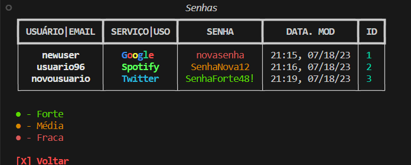

## `🔐` PW Manager

### Gerenciador de senhas

## `💻` Requisitos
1. Python Instalado
- [Windows](https://www.python.org/downloads/)
     - Choco: `choco install python`
   - [Mac](https://www.python.org/downloads/)
     - Brew: `brew install python3` and `brew install pip3`
   - [Ubuntu Guide](https://linuxize.com/post/how-to-install-python-3-9-on-ubuntu-20-04/)

### `⚙` Instalação
1. Execute o arquivo `setup.py` **apenas na PRIMEIRA instalação**
2. Execute o arquivo `main.py`

### `❓` Como usar?

- Todas as senhas são mostradas em uma tabela. As quais ficam salvas no arquivo `passwords.db`.
- Na tabela, cada linha contém: `USUÁRIO`, `SERVIÇO`, `SENHA`, `DATA. MOD` e `ID`
    - `USUÁRIO/ EMAIL`: o username ou email proprietário da senha
    - `SERVIÇO` : Uso da senha Ex.: Instagram, YouTube, Gmail...
    - `SENHA` : A senha armazenada.
    - `DATA. MOD`: A data e hora da **criação/última modificação** da senha.

- Para Salvar uma nova senha, basta descer as opções do menu e selecionar `Criar Nova`
    - Preencha os dados pedidos e confirme digitando a senha **duas vezes** e a senha ficará salva.
- Para deletar uma senha, basta selecionar no menu a opção `Deletar`
    - Digite o `ID` da senha que deseja deletar e confirme.
    - `⚠️` Você também pode digitar `'sair'` caso queira cancelar a operação
- Para modificar uma senha, desca as opções do menu até `Modificar`
- Cada Serviço de senha possui sua própria cor na tabela
- Cada senha aparece com uma cor diferente dependendo do quão forte ela é (essa função não está 100% finalizada)

### Mostrando a aplicação
Menu Inicial

Tabela de senhas

### `⚙️` Futuras atualizações
1. Gerador de senha
2. Função de copiar senha pelo id
3. Melhorias na classificação de senhas
